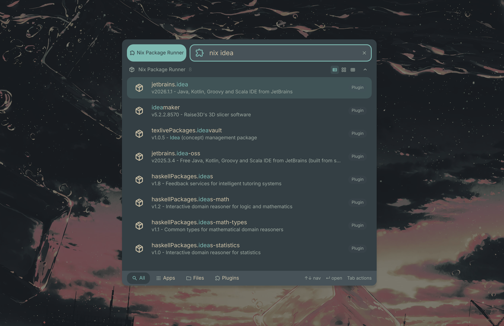

# Nix Package Runner

A DankMaterialShell launcher plugin for searching and running nixpkgs packages.

## Features

- Search nixpkgs packages using `nix search`
- Launch packages directly with `nix run`
- Run packages in terminal
- Copy `nix shell` commands to clipboard
- Copy attribute paths
- Recent packages history
- Configurable trigger prefix
- Allow/unfree package support
- Local locked or latest unstable nixpkgs source

## Installation

```bash
mkdir -p ~/.config/DankMaterialShell/plugins
cd ~/.config/DankMaterialShell/plugins
git clone https://github.com/iahccc/NixPackageRunner.git
```

Then open DMS Settings → Plugins → Scan for Plugins, and enable Nix Package Runner.

## Dependencies

- `nix`
- `jq`
- `wl-clipboard`

## Usage

1. Open the launcher and type your trigger (default: `nix`) followed by a package name, e.g. `nix helix`
2. Press Enter to launch with `nix run`, or use the context menu for terminal and copy actions

## Configuration

| Setting | Description | Default |
|---------|-------------|---------|
| Trigger | Prefix to activate the plugin | `nix` |
| Run in terminal by default | Open terminal for package runs | `false` |
| Allow unfree packages | Include unfree packages in search | `true` |
| Run Source | nixpkgs source for running packages | `local_locked` |
| Max results | Number of search results | `8` |
| Terminal | Terminal command | `kitty` |
| Exec flag | Terminal exec flag | `-e` |

## Screenshot


